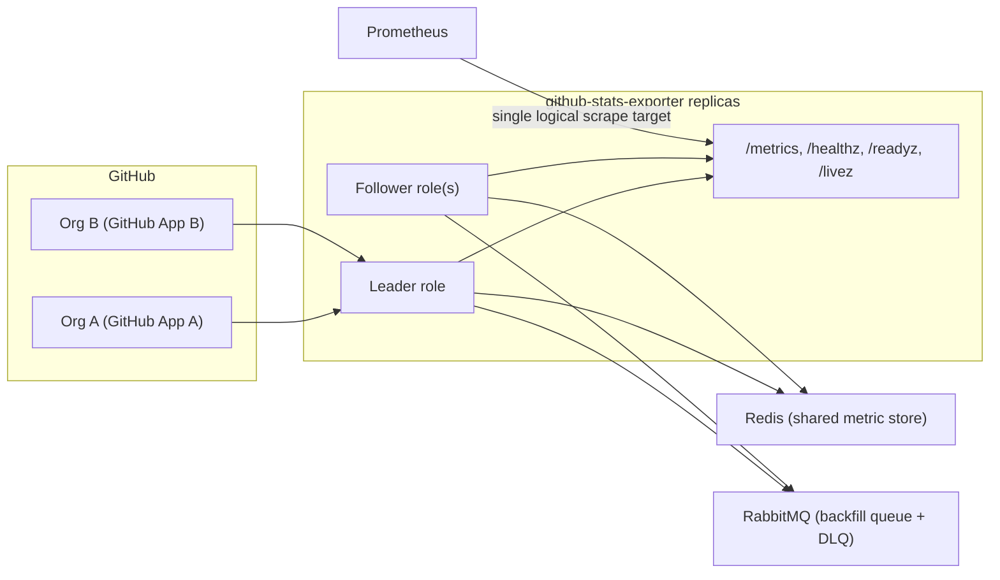
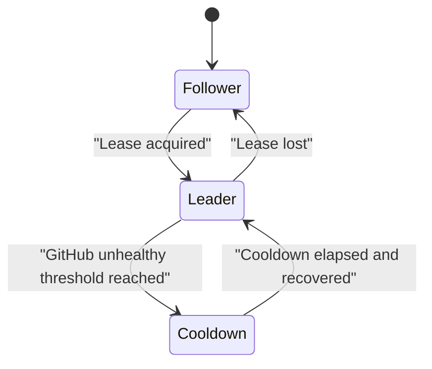
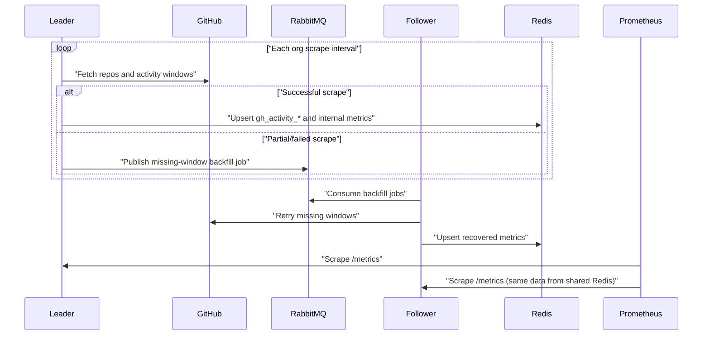

# GitHub Stats Exporter

[](https://github.com/cam3ron2/github-stats-exporter/actions/workflows/test.yml)
[](https://github.com/cam3ron2/github-stats-exporter/actions/workflows/lint.yml)
[](https://github.com/cam3ron2/github-stats-exporter/actions/workflows/release.yml)
[](https://goreportcard.com/report/github.com/cam3ron2/github-stats-exporter)
[](https://github.com/cam3ron2/github-stats-exporter/blob/main/go.mod)

`github-stats-exporter` scrapes contributor activity from one or more GitHub organizations and exposes the result as OpenMetrics for Prometheus-style scraping and dashboards, or forwarding to the monitoring/observability platform of your choice.

## Why this exists

GitHub provides rich APIs for organizational and contributor activity, but extracting actionable metrics at scale can be complex. This project offers a turnkey solution to:

- Produce contributor-level metrics with mandatory `org`, `repo`, and `user` labels.
- Support multi-org scraping with separate GitHub App credentials per organization.
- Run in HA mode with leader election and a shared Redis metric store.
- Use RabbitMQ-backed backfill to recover missed scrape windows.
- Expose internal health, rate-limit, queue, and throughput telemetry for operations.

## What you get

- **Business metrics (activity):**
  - `gh_activity_commits_24h{org,repo,user}`
  - `gh_activity_prs_opened_24h{org,repo,user}`
  - `gh_activity_prs_merged_24h{org,repo,user}`
  - `gh_activity_reviews_submitted_24h{org,repo,user}`
  - `gh_activity_issue_comments_24h{org,repo,user}`
  - `gh_activity_loc_added_weekly{org,repo,user}`
  - `gh_activity_loc_removed_weekly{org,repo,user}`
  - `gh_activity_last_event_unixtime{org,repo,user}`
- **Operational metrics (exporter/runtime):**
  - scrape outcomes and durations
  - GitHub rate-limit and request counters
  - queue depth/age and backfill outcomes
  - dependency health and store write results

## Documentation index

| Topic | Link |
| --- | --- |
| Full configuration reference | [docs/configuration.md](docs/configuration.md) |
| Required GitHub App permissions | [docs/github_app_permissions.md](docs/github_app_permissions.md) |
| Detailed implementation plan | [docs/internal/implementation_plan.md](docs/internal/implementation_plan.md) |
| Runtime operations runbook | [docs/internal/runtime_operational_runbook.md](docs/internal/runtime_operational_runbook.md) |
| Load/resilience validation | [docs/internal/load_and_resilience_validation.md](docs/internal/load_and_resilience_validation.md) |
| Release pipeline design | [docs/internal/release_pipeline.md](docs/internal/release_pipeline.md) |
| Kustomize secret handling | [deploy/kustomize/overlays/SECRETS.md](deploy/kustomize/overlays/SECRETS.md) |

## Architecture overview



## Controller and Data Logical Flow

### Leader/follower behavior



### Scrape, persist, backfill



## Quick start (local)

### 1) Prerequisites

- Go 1.25+
- Docker + Docker Compose
- GitHub App(s) with required permissions per [docs/github_app_permissions.md](docs/github_app_permissions.md)

### 2) Configure GitHub credentials

1. Copy or create a PEM key at `config/keys/gh-app-key.pem`.
1. Update `config/local.yaml`:
   - `github.orgs[].org`
   - `github.orgs[].app_id`
   - `github.orgs[].installation_id`
   - `github.orgs[].private_key_path`

### 3) Start the exporter and its dependencies

```bash
docker-compose up --build
```

### 4) Validate endpoints

```bash
curl -s http://localhost:8080/livez
curl -s http://localhost:8080/readyz
curl -s http://localhost:8080/healthz
curl -s http://localhost:8080/metrics | head -50
```

## Kubernetes deployment (Kustomize)

The repository includes base manifests plus `nonprod` and `prod` overlays. These manifests are designed for reference and may require adjustments for your specific cluster, namespace, and secret management approach.

> Note: a Helm chart is not currently provided, but may be added in the future based on demand.

```bash
# nonprod
kubectl apply -k deploy/kustomize/overlays/nonprod

# prod
kubectl apply -k deploy/kustomize/overlays/prod
```

Before applying overlays, prepare generated secrets using:

- [deploy/kustomize/overlays/SECRETS.md](deploy/kustomize/overlays/SECRETS.md)

Prometheus scrape and alert examples are in:

- [deploy/prometheus/github-stats-scrape.yaml](deploy/prometheus/github-stats-scrape.yaml)
- [deploy/prometheus/github-stats-alert-rules.yaml](deploy/prometheus/github-stats-alert-rules.yaml)

## Configuration and operations

- Config schema and every field: [docs/configuration.md](docs/configuration.md)
- Runtime operations and failure behavior: [docs/internal/runtime_operational_runbook.md](docs/internal/runtime_operational_runbook.md)
- Load and resilience checks: [docs/internal/load_and_resilience_validation.md](docs/internal/load_and_resilience_validation.md)

## CI/CD and release model

- PR testing: `.github/workflows/test.yml`
- Linting: `.github/workflows/lint.yml`
- Release on `main` merge: `.github/workflows/release.yml`
- SemVer + changelog automation via Conventional Commits and semantic-release
- Go binaries via GoReleaser
- Multi-arch (`amd64`, `arm64`) container publishing to GHCR

See full details in [docs/internal/release_pipeline.md](docs/internal/release_pipeline.md).

## Development commands

```bash
# tests
make test

# lint
make lint

# functional compose checks (requires running stack)
./scripts/compose-functional-check.sh
```

## Limitations

- Cardinality is intentionally high due `org`, `repo`, and `user` labels on activity series.
  - This design prioritizes user-level insights and flexibility in aggregation at the cost of higher series counts.
  - Prometheus recording rules can be used to create rollups if needed for performance.
  - Users should monitor series cardinality and adjust scrape intervals or retention as needed based on their scale and Prometheus capacity.
- LOC metrics source data from GitHub's `/stats/contributors` endpoint as their primary source; this is summary-oriented, not real-time. Summaries are updated by GitHub on their own schedule (often daily) and may lag behind real-time activity, but they are more efficient and less rate-limit prone than commit-level data.
  - The fallback LOC mode using `/commits` and `/commits/{sha}` is _considerably_ more API intensive and should be used with caution, especially at scale. It may not be feasible to run regularly for large orgs/repos due to rate limits and performance, as this will cause _every commit_ in the scrape window to require two API calls (one for listing and one for details).
- Backfill and cooldown logic prioritize continuity and API safety over immediate freshness during GitHub outages.
